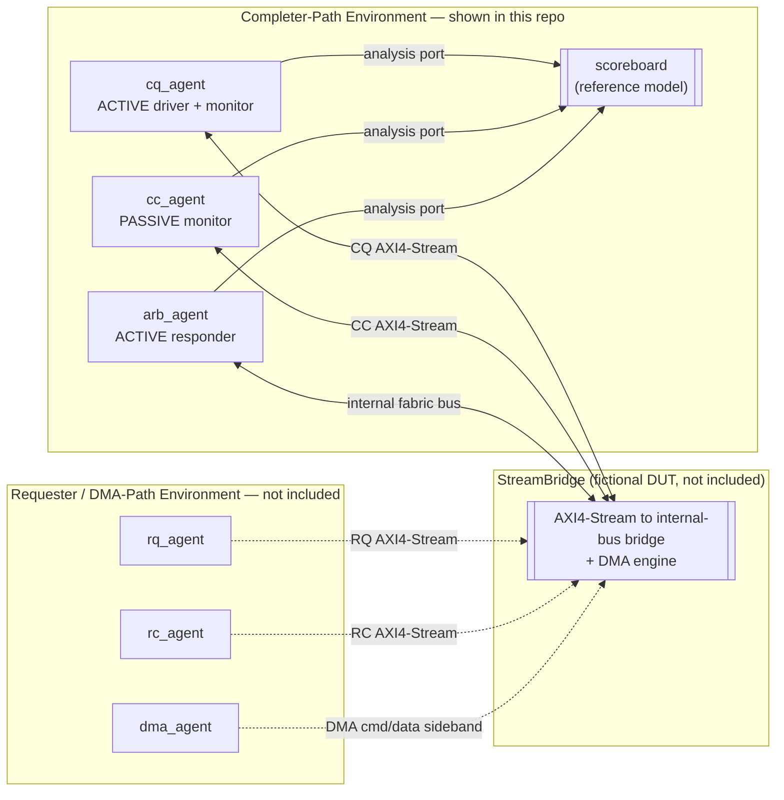

<h1 align="center">StreamBridge UVM Verification Environment</h1>

<p align="center">
  A from-scratch UVM testbench excerpt for a fictional AXI4-Stream-to-internal-bus bridge IP.
</p>

<p align="center">
  
  
  
  
</p>

> **This is an original, independently-built verification environment created as a
> portfolio project.** It demonstrates the same architectural patterns and methodology
> — tag-indexed scoreboarding, split completer/requester UVM environments, wide-bus
> lane verification — used in professional ASIC/FPGA verification work, built from
> scratch with an original DUT design (StreamBridge) and original signal names,
> register encodings, and class structure throughout. It is **not** production code
> and does not name, describe, or reproduce any real employer's or client's IP.

---

## Overview

**StreamBridge** is a fictional bridge IP that adapts the four industry-standard
AXI4-Stream interface roles used by Xilinx-style PCIe integrated blocks — **Completer
Request (CQ)**, **Completer Completion (CC)**, **Requester Request (RQ)**, and
**Requester Completion (RC)**, as defined publicly in Xilinx PG156 — onto an internal
wide, arbitrated read/write memory bus and a DMA command/data path.

The full environment splits into two configurations: a **completer-path** environment
(host-initiated register/BAR reads and writes) and a **requester/DMA-path** environment
(device-initiated DMA transfers to host memory) — matching how these two traffic
classes are actually driven and checked in silicon-bound verification.

**This repository shows the completer-path slice in full** (interface, transaction
class, scoreboard, all three of its agents, one sequence, one test) as a coherent,
readable example of the methodology. The requester/DMA-path slice — `rq_agent`,
`rc_agent`, `dma_agent`, `environment_dma.sv`, and the DMA-focused sequences and
tests — is intentionally not included; its role is described below instead. The DUT
itself was always a placeholder (not included in either slice) and no simulator was
used to build this repository, so the emphasis throughout is on correct, idiomatic
UVM *structure* rather than a run-and-passing regression.

## Architecture



Each `uvm_test` builds one environment. This repo's kept test builds
`stream_bridge_env` (the completer-path environment) — mirroring how the real
testbench splits its two top-level configurations instead of running every agent
against every test.

## Verification Environment

| Component | File | Active/Passive | Responsibility |
|---|---|---|---|
| `cq_agent` | `src/agents/cq_agent.sv` | Active | Drives host register/BAR read & write requests into the CQ AXI4-Stream interface |
| `cc_agent` | `src/agents/cc_agent.sv` | Passive | Monitors completions StreamBridge returns on CC; asserts `tready` as an always-ready host model |
| `arb_agent` | `src/agents/arb_agent.sv` | Active | Models the shared fabric/memory side of the internal 256-bit arbitrated bus |
| `stream_bridge_scoreboard` | `src/env/scoreboard.sv` | — | Reference model: tag-indexed outstanding-transaction tracking + wide-bus shadow memory |
| `stream_bridge_env` | `src/env/environment.sv` | — | Completer-path top-level environment (cq + cc + arb + scoreboard) |

**Not included** (requester/DMA-path role, described for completeness):

| Component | Role |
|---|---|
| `rq_agent` | Passive — monitors DMA-engine-issued requests StreamBridge sends toward host memory on RQ |
| `rc_agent` | Active — reacts to RQ read requests and returns deterministic host completion data on RC |
| `dma_agent` | Active — drives the DMA command sideband and monitors command retirement |
| `stream_bridge_dma_env` | Requester/DMA-path top-level environment (rc + rq + dma + arb + scoreboard) |

### Scoreboard highlights

The scoreboard shown here is the *same* reference model used by both traffic classes
in the full environment — it's written generically over `requester_id`/`tag`, so
nothing about it changes for the requester/DMA path; only the agents that feed it
differ.

- **`outstanding[requester_id][tag]`** — a nested associative array. CQ requests open
  an entry; CC completions close it and are checked against the DWORD count implied
  by the original request's length.
- **Shadow fabric-bus memory** — every fabric-bus write is decomposed into its
  8 x 32-bit lanes using the write-strobe and stored per 32-byte line; every
  subsequent read at that line is checked lane-by-lane against what was last written.
  Misaligned (non-32-byte) fabric accesses are flagged directly.
- **`report_phase`** — prints a pass/fail-relevant summary (completions checked,
  fabric writes/reads checked, error count) and warns on any transaction left
  outstanding at the end of a test.

## What's Verified

One focused test is included, extending `base_test` (`src/tests/base_test.sv`):

| Test | File | Covers |
|---|---|---|
| `test_cpl_write_readback` | `test_cpl_write_readback.sv` | Single completer write followed by a read-back to the same address — CQ/CC/fabric-bus coherency for one transaction |

The full suite this was drawn from also included continuous pipelined completer
bursts (tag reuse under load) and three DMA-path tests (single read, single write,
and a 4 B → 4 KB size sweep) — omitted here along with the DMA agents they exercise.

## Repository Structure

```
axi-stream-bridge-uvm-verification/
├── LICENSE
├── README.md
├── .gitignore
├── sim/
│   └── Makefile                     # Cadence Xcelium regression targets
└── src/
    ├── stream_bridge_pkg.sv         # top-level package, pulls in all classes
    ├── env/
    │   ├── stream_bridge_if.sv      # CQ/CC + fabric bus signals
    │   ├── seq_item.sv              # unified sb_txn transaction class
    │   ├── sequences.sv             # write-readback + arbiter responder
    │   ├── scoreboard.sv            # reference model (centerpiece file)
    │   └── environment.sv           # completer-path env
    ├── agents/
    │   ├── cq_agent.sv              # ACTIVE
    │   ├── cc_agent.sv              # PASSIVE
    │   └── arb_agent.sv             # ACTIVE
    └── tests/
        ├── base_test.sv
        └── test_cpl_write_readback.sv
```

## Running the Regression

The environment targets Cadence Xcelium via `sim/Makefile`. No simulator license was
available while building this repository, and the DUT and top-level testbench module
are intentionally not included, so this has not been run end-to-end — it's provided
to show the intended regression flow.

```bash
cd sim

# Run the included focused test
make test TEST=test_cpl_write_readback

# Clean simulation artifacts
make clean
```

## Author

**Ajay Krishna Varma** — Hardware Verification Engineer

- Email: [ajaymandapati4@gmail.com](mailto:ajaymandapati4@gmail.com)
- LinkedIn: [linkedin.com/in/ajay-varma-m-8071a4263](https://www.linkedin.com/in/ajay-varma-m-8071a4263/)

## License

Published for portfolio review only — see [LICENSE](LICENSE). Not open source;
no reuse permission is granted.
