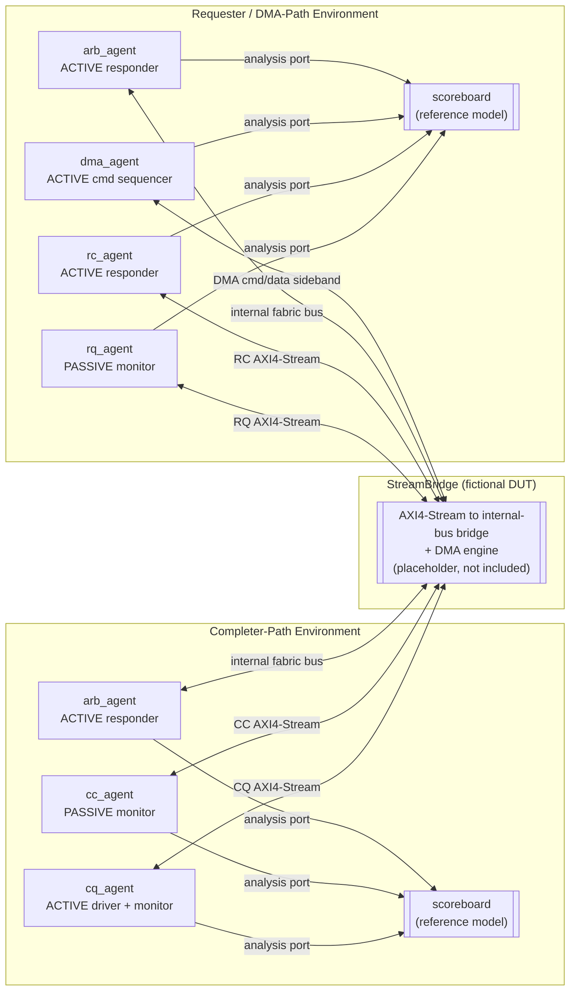

<h1 align="center">StreamBridge UVM Verification Environment</h1>

<p align="center">
  A from-scratch UVM testbench for a fictional AXI4-Stream-to-internal-bus bridge IP.
</p>

<p align="center">
  
  
  
  
</p>

> **This is an original, independently-built verification environment created as a
> portfolio project.** It demonstrates the same architectural patterns and methodology
> — tag-indexed scoreboarding, split completer/requester UVM environments, wide-bus
> lane verification — used in professional ASIC/FPGA verification work, built from
> scratch with an original DUT design (StreamBridge) and original signal names,
> register encodings, and class structure throughout. It is **not** production code
> and does not name, describe, or reproduce any real employer's or client's IP.

---

## Overview

**StreamBridge** is a fictional bridge IP that adapts the four industry-standard
AXI4-Stream interface roles used by Xilinx-style PCIe integrated blocks — **Completer
Request (CQ)**, **Completer Completion (CC)**, **Requester Request (RQ)**, and
**Requester Completion (RC)**, as defined publicly in Xilinx PG156 — onto an internal
wide, arbitrated read/write memory bus and a DMA command/data path.

This repository is a clean-room UVM verification environment built for that fictional
DUT, written to demonstrate the methodology used to verify bridges of this shape:

- Splitting the environment into a **completer-path** configuration (host-initiated
  register/BAR reads and writes) and a **requester/DMA-path** configuration
  (device-initiated DMA transfers to host memory), matching how these two traffic
  classes are actually driven and checked in silicon-bound verification.
- A **reference-model scoreboard** that tracks outstanding transactions keyed by
  `[requester_id][tag]`, validates completion DWORD/byte counts against the
  originating request, and independently shadow-models the internal wide bus to catch
  lane-extraction and address-alignment bugs.
- Idiomatic, active/passive UVM agent structure per interface role, with sequences
  covering write-then-readback, DMA size sweeps, and continuous burst traffic.

The DUT itself is a **placeholder** — see [`StreamBridge_stub.sv`](src/top/StreamBridge_stub.sv).
No simulator was used to build this repository, so the emphasis throughout is on
correct, idiomatic UVM *structure* and internal consistency rather than a
run-and-passing regression.

## Architecture



Each `uvm_test` builds exactly one of the two environments (`stream_bridge_env` for
completer-path tests, `stream_bridge_dma_env` for DMA-path tests) — mirroring how the
real testbench splits its two top-level configurations instead of running every agent
against every test.

## Verification Environment

| Component | File | Active/Passive | Responsibility |
|---|---|---|---|
| `cq_agent` | `src/agents/cq_agent.sv` | Active | Drives host register/BAR read & write requests into the CQ AXI4-Stream interface |
| `cc_agent` | `src/agents/cc_agent.sv` | Passive | Monitors completions StreamBridge returns on CC; asserts `tready` as an always-ready host model |
| `rq_agent` | `src/agents/rq_agent.sv` | Passive | Monitors DMA-engine-issued requests StreamBridge sends toward host memory on RQ |
| `rc_agent` | `src/agents/rc_agent.sv` | Active | Reacts to RQ read requests and returns deterministic host completion data on RC |
| `dma_agent` | `src/agents/dma_agent.sv` | Active | Drives the DMA command sideband and monitors command retirement (`dma_done_*`) |
| `arb_agent` | `src/agents/arb_agent.sv` | Active | Models the shared fabric/memory side of the internal 256-bit arbitrated bus |
| `stream_bridge_scoreboard` | `src/env/scoreboard.sv` | — | Reference model: tag-indexed outstanding-transaction tracking + wide-bus shadow memory |
| `stream_bridge_env` | `src/env/environment.sv` | — | Completer-path top-level environment (cq + cc + arb + scoreboard) |
| `stream_bridge_dma_env` | `src/env/environment_dma.sv` | — | Requester/DMA-path top-level environment (rc + rq + dma + arb + scoreboard) |

### Scoreboard highlights

- **`outstanding[requester_id][tag]`** — a nested associative array shared by both
  traffic classes. CQ/RQ requests open an entry; CC/RC completions close it and are
  checked against the DWORD count implied by the original request's length. DMA
  traffic uses a fixed internal `requester_id` (`0xDA00`) so it lands in the same
  structure as host-issued completer traffic.
- **Shadow fabric-bus memory** — every fabric-bus write is decomposed into its
  8 x 32-bit lanes using the write-strobe and stored per 32-byte line; every
  subsequent read at that line is checked lane-by-lane against what was last written.
  Misaligned (non-32-byte) fabric accesses are flagged directly.
- **`report_phase`** — prints a pass/fail-relevant summary (completions checked, DMA
  reads checked, fabric writes/reads checked, error count) and warns on any
  transaction left outstanding at the end of a test.

## What's Verified

Five focused tests, each extending `base_test` (`src/tests/base_test.sv`):

| Test | File | Covers |
|---|---|---|
| `test_cpl_write_readback` | `test_cpl_write_readback.sv` | Single completer write followed by a read-back to the same address — CQ/CC/fabric-bus coherency for one transaction |
| `test_cpl_continuous_burst` | `test_cpl_continuous_burst.sv` | 32 pipelined write-then-readback pairs with no forced idle gaps — tag reuse timing and outstanding-transaction tracking under load |
| `test_dma_single_read` | `test_dma_single_read.sv` | One device-initiated DMA read of host memory — RQ/RC completion path and DMA-engine tag tracking |
| `test_dma_single_write` | `test_dma_single_write.sv` | One device-initiated DMA write to host memory — posted-write semantics (no RC expected) |
| `test_dma_size_sweep` | `test_dma_size_sweep.sv` | DMA write-then-read-back swept across 4 B -> 4 KB — length/last-beat handling and DWORD-count checking across sizes |

## Repository Structure

```
axi-stream-bridge-uvm-verification/
├── LICENSE
├── README.md
├── .gitignore
├── sim/
│   └── Makefile                     # Cadence Xcelium regression targets
└── src/
    ├── stream_bridge_pkg.sv         # top-level package, pulls in all classes
    ├── env/
    │   ├── stream_bridge_if.sv      # CQ/CC/RQ/RC + fabric bus + DMA sideband
    │   ├── seq_item.sv              # unified sb_txn transaction class
    │   ├── sequences.sv             # write-readback, size-sweep, responders, ...
    │   ├── scoreboard.sv            # reference model (centerpiece file)
    │   ├── environment.sv           # completer-path env
    │   └── environment_dma.sv       # requester/DMA-path env
    ├── agents/
    │   ├── cq_agent.sv              # ACTIVE
    │   ├── cc_agent.sv              # PASSIVE
    │   ├── rq_agent.sv              # PASSIVE
    │   ├── rc_agent.sv              # ACTIVE
    │   ├── dma_agent.sv             # ACTIVE
    │   └── arb_agent.sv             # ACTIVE
    ├── tests/
    │   ├── base_test.sv
    │   ├── test_cpl_write_readback.sv
    │   ├── test_cpl_continuous_burst.sv
    │   ├── test_dma_single_read.sv
    │   ├── test_dma_single_write.sv
    │   └── test_dma_size_sweep.sv
    └── top/
        ├── StreamBridge_stub.sv     # placeholder DUT (proprietary RTL not included)
        └── tb_top.sv                # clock/reset, DUT instance, run_test()
```

## Running the Regression

The environment targets Cadence Xcelium via `sim/Makefile`. No simulator license was
available while building this repository, so these targets have not been executed
end-to-end — they are provided to show the intended regression flow.

```bash
cd sim

# Run one focused test
make test TEST=test_cpl_write_readback

# Run with a fixed seed and higher verbosity
make test TEST=test_dma_size_sweep SEED=12345 VERBOSITY=UVM_HIGH

# Run the full five-test focused suite
make regress

# Run with waveform capture enabled
make waves TEST=test_dma_single_read

# Clean simulation artifacts
make clean
```

## Author

**Ajay Krishna Varma** — Hardware Verification Engineer

- Email: [ajaymandapati4@gmail.com](mailto:ajaymandapati4@gmail.com)
- LinkedIn: [linkedin.com/in/ajay-varma-m-8071a4263](https://www.linkedin.com/in/ajay-varma-m-8071a4263/)

## License

Released under the [MIT License](LICENSE).
